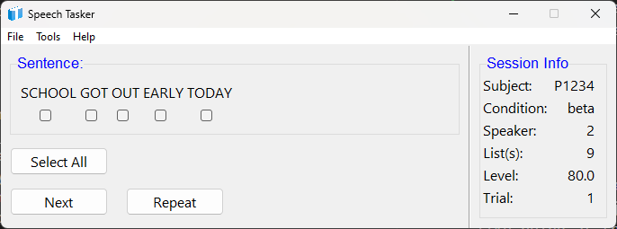
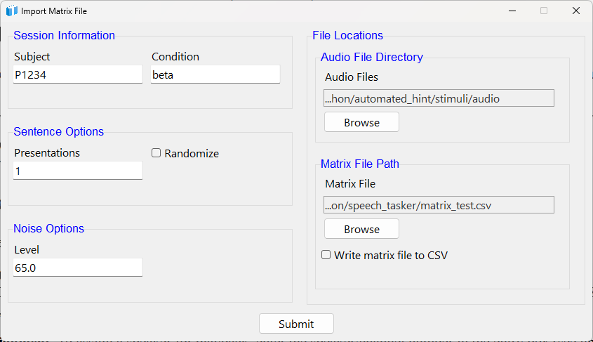
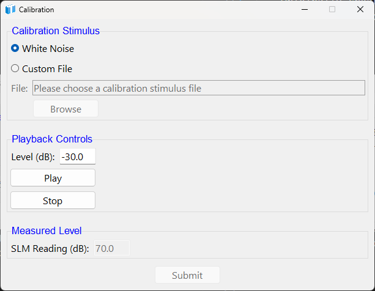

<div style="text-align: center;">
    
</div>

<div style="text-align: center;">
    <h1>Speech Tasker</h1>

    Written by: <b>Travis M. Moore</b>
    <br>
    Latest version: <b>Version 1.0.0</b><br>
    Originally created: <b>December 07, 2022</b><br>
    Last edited: <b>July 02, 2024</b><br><br>
</div>

---

# Description
Speech Tasker improves data quality for speech testing by providing control over trials, built-in calibration, audio presentation, GUI-based scoring, and data recording. 

The Speech Tasker application offers a standardized way to present speech test materials (e.g., HINT, IEEE). The Speech Tasker presentations are controlled using CSV files with trial information (referred to as matrix files). Calibration and audio routing capabilities are built in. Scoring is simple: only key words have a checkbox beneath them, and clicking the checkbox indicates the participant repeated that word correctly. Data are output in CSV format for later analysis.
<br>
<br>

---

# Getting Started
## Dependencies
- Windows 10 or greater (not compatible with Mac OS)

## Installing
- This is a compiled app; the executable file is stored on Starfile at: \\starfile\Public\Temp\MooreT\Custom Software

- Simply copy the executable file and paste to a location on the local machine.

- **DO NOT RUN FROM THE STARFILE SERVER.** This ties up the program for others, and will result in erratic app behavior. 

## First Use
- **DO NOT RUN FROM THE STARFILE SERVER.** This ties up the program for others, and will result in erratic app behavior. That's right, this statement is identical to the one above - it's just that important!

- Double-click to start the application for the first time.

- Navigate to File>Import Matrix File, or File>Create Matrix File

- Navigate to File>Start to begin the task. 

<b>NOTE:</b> Speech test materials are not included and must be provided when importing or creating a matrix file. 
<br>
<br>

---

# Main Screen
The Speech Tasker main screen (below) offers all the controls you will need to present and score a task.



## Presentation Controls
- Use the ```Next``` button to present a trial.

- Use the ```Repeat``` button to repeat the audio presentation without scoring or moving to the next trial.

## Scoring Controls
- The ```Sentence``` window will display the word(s) for a given trial. Checkboxes will appear beneath key words only. Click the checkbox below a word to indicate that the participant repeated that word correctly. Words with empty checkboxes will be counted as incorrect.

- The ```Select All``` button is a convenience feature that will select all checkboxes for you. 

- The ```Next``` button will record the words correct (and incorrect) and start the next trial. 

## Session Info
The current session details are displayed in a side panel. Variable values (e.g., level) update in real time. A trial counter is also located here. 
<br>
<br>

---

# File Menu
## File>Import Matrix File
This command opens a window where you can provide session details (see below). 



### Session Information
- Subject: A unique subject identifier. Can be alpha, numeric, or both.

- Condition: A <strong>UNIQUE</strong> condition name. Can be alpha, numeric, or both. Separate words with underscores.

### Sentence Options
- Presentations: Number of times to present all trials. For example, entering "1" will simply play the trials in the matrix file. Entering "2" will play each trial twice.

- Randomize: Select if you want to randomize trials in provided matrix file. If unselected, trials will be presented in the exact order given in the matrix file.

### Noise Options
- Level: The level of the background noise. Currently, nothing is done with the level, but it is included in the output file to help with analysis. 

### File Locations
- Audio File Directory: Browse to the <strong>FOLDER</strong> containing the audio files. 

- Matrix File Path: Browse to the exact <strong>MATRIX FILE</strong> to use for the session. 

- Write matrix file to CSV: If you randomize and/or specify multiple presentations, selecting this checkbutton will create a CSV of the repeated/randomized trials once the task has started (not when you click ```Submit```).

## File>Create Matrix File
This command opens a window to automate matrix file creation. Simply provide the required data and click ```Submit```; a file called ```matrix_file.csv``` will be created in the application's current directory. 


### Session Information
- Subject: A unique subject identifier. Can be alpha, numeric, or both.

- Condition: A <strong>UNIQUE</strong> condition name. Can be alpha, numeric, or both. Separate words with underscores.

### Sentence Options
- List(s): The list numbers to include in the session. Separate multiple values with a comma and space: ```1, 2, 3```.

- Level(s): Either a single level (that will be applied to all lists) or multiple levels (must be one per list). Separate multiple values with a comma and space: ```1, 2, 3```.

- Speaker(s): Either a single speaker for all lists, or a list of multiple speakers (must be one per list). Separate multiple values with a comma and space: ```1, 2, 3```.

- Sentences per List: The number of sentences to include from each list.

- Presentations: Number of times to present all trials. For example, entering "1" will simply play the trials in the matrix file. Entering "2" will play each trial twice.

- Randomize: Select if you want to randomize trials in provided matrix file. If unselected, trials will be presented in the exact order given in the matrix file.

### Noise Options
- Level: The level of the background noise. Currently, nothing is done with the level, but it is included in the output file to help with analysis. 

### File Locations
- Audio File Directory: Browse to the <strong>FOLDER</strong> containing the audio files. 

- Sentence CSV File: Browse to the exact <strong>CSV FILE</strong> containing the sentences/words to use for the session. 

<b>Note:</b> A matrix CSV file is generated after clicking ```Submit```.

## File>Start
The command to begin the task is under the ```File``` menu to avoid accidental starts by participants. 
<br>
<br>

---

# Tools Menu
## File>Audio Settings
The Audio Settings window allows you to select an audio device and assign speakers for playback <b>during calibration</b>: the matrix file ```speakers``` column will control playback during testing. 


### Channel Routing
To assign a speaker for playback during calibration, enter the speaker/channel number in the ```Channels``` text box.

<b>Note:</b>: You must provide a speaker for each channel in the audio file. For example, if your stimulus has eight channels, you must provide a list of eight speakers. Separate numbers with a comma and space when providing a list of speakers. For example: ```1, 2, 3, 4, 5, 6, 7, 8```.

### Device Selection
The Audio Settings window displays available audio devices in a scrollable table. Simply click to choose the desired device. Your selection will be highlighted in blue.

## File>Calibration
The Calibration window (below) provides a simple way to calibrate your stimuli using a sound level meter (SLM). 

<b>NOTE:</b> Calibration files are imported without any scaling applied. In essence, "dB FS" is simply however the system is set, and the original level of the recording. 



### Calibration Stimulus
You can choose to use the built-in white noise, or provide a custom file for the calibration signal (top group in image). If a multi-channel calibration file is provided, ensure the correct number of channels have been assigned in ```Tools>Audio Settings```. 

### Playback Controls
Use the ```Level (dB)``` text box to adjust the digital playback level in dB (middle group in image). Adjusting the level here acts like a volume control. Adjust the level until the SLM reads above the noise floor of the room (e.g., ~80 dB). The Play and Stop buttons allow you to start and stop the audio playback.

### Measured Level
Use an SLM to measure the level of the calibration signal and enter the value into the ```SLM Reading (dB)``` text box (bottom group in image). Click submit, and the application will calculate an offset so that you can specify presentation levels in dB (whichever type of dB you set the SLM to when measuring). 

<b>NOTE:</b> For multi-channel files, the same SLM offset is applied to each channel individually. <b>Currently there is not support for multiple SLM offsets.</b>

<b>NOTE:</b> The ```Submit``` button is disabled until you click the ```Play``` button. 
<br>
<br>

---

# Compiling from Source
```
pyinstaller --noconfirm --onefile --windowed 
```
<br>
<br>

---

# Contact
Please use the contact information below to submit bug reports, feature requests and any other feedback.

- Travis M. Moore: travis_moore@starkey.com
